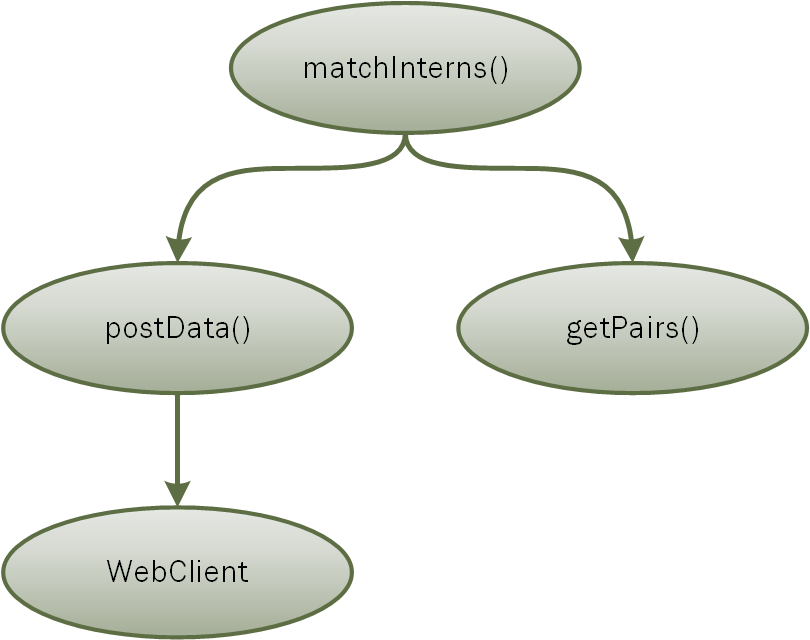
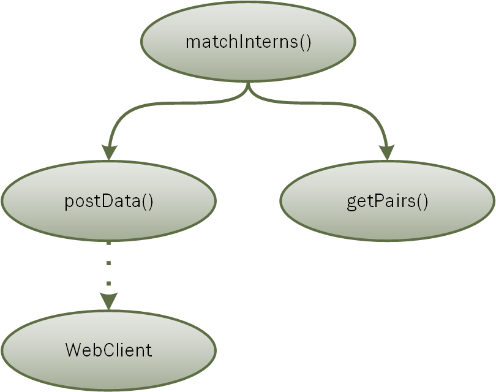
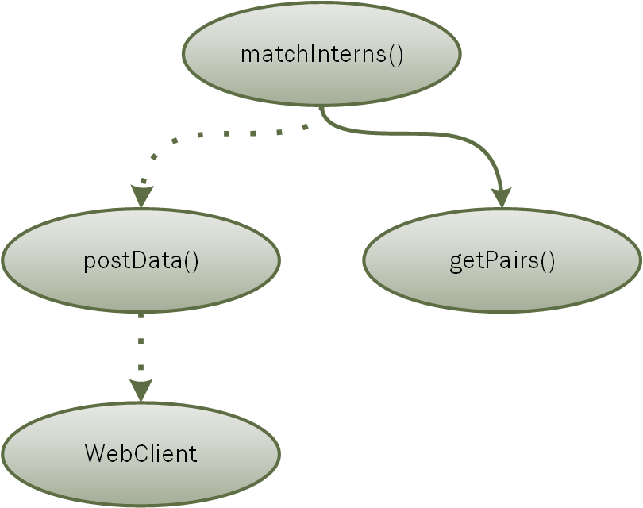

# FSharp Inversion Of Control demo

*A demonstration with commentary to illustrate Inversion of Control for testing in F#.*

A lot of well-written code is very hard to test. The aim of this exercise is to show how to refactor code so that it can be tested properly.

# Code commentary

## Introduction

This solution has a series of modules, where a codebase evolves into a form of being testable via Inversion of Control.

The code's purpose is to pair interns up with senior engineers, then submit the results to some endpoint (via a web post). We expect an exception to be thrown if there aren't enough senior engineers to be matched up with the interns.

## Module A_Composed

Module A_Composed is our starting point.

This code is well modularized. *postData()* is doing operational work, *getPairs()* has business logic, and *matchInterns()* orchestrates everything.

From a testing perspective, we can only test *getPairs()* independently from the other functions because it has no dependencies on other code. One of the major difficulties we have here is that in order to test *matchInterns()*, our tests have reflect business logic from *getPairs()* *TODO: show that testing for failure conditions requires seniors.length to be less than interns.length*
* This business logic has nothing to do with *matchInterns()*'s purpose.
* Changes to *getPairs()* will likely cause changes to *matchInterns()*'s tests.

What all of this means is that while our code is cleanly modularized for a regular production flow, it's not modularized from a testing perspective. It's going to be a large burden to write and maintain tests for this code, and we're only going to have so much faith in the tests' accuracy.

We also have another problem here, which is that even when we run tests, we're going to be making actual web posts. If we were to write tests for this code in its current state, we could have a hosted endpoint that receives posts in testing scenarios, and we can pass that endpoint into *matchInterns()*, but this is overly complex and slow, if not unreliable. That might be a good solution for end-to-end testing, but not for unit tests. Solving this problem is annoying, but conceptually easy, so let's knock it out first.

## Module B_ComposedIsolated

*WebClient* is a sealed class that doesn't have a strong interface. If it wasn't sealed, we could potentially inherit from it to build a fake, and if it had a clean interface, we could make a mock out of that.

Because *WebClient* is locked down, we had to build a wrapper type with an interface. In our production flow, the wrapper type will call a *WebClient* on our behalf, but now in our tests, we can have a fake implementation that emulates the behavior of a web post. For convenience, the byte array conversion logic was moved into the wrapper, which makes *postData()*'s work in formatting the data and triggering a post a little more clear.

As a result of our change, *postData()* is now fully testable because we can supply it our own versions of its dependency. We can now effectively treat it as a leaf on this dependency tree. This is what "inversion of control" is - basically some outside force is choosing what this function should act upon, while guaranteeing that the function knows how to interact with whatever it's given.

Note how we have to pass *webClient* into *matchInterns()*, even though it doesn't do anything but pass it along - let's fix that with partial application.

## Module C_IsolatedWithRegistration

When we partially apply parameters to *postData()*, type inference kicks in and the generic type gets resolved. There is an example of this in the code that is commented out - it doesn't compile, because it resolves *postData'()* to *Pair* because it's the first type that it can infer; it then rejects our attempt to post *Seniors* within the same function. To work around this, we have to let the generic type resolve in two different statements, and pass them into *matchInterns()* independently. The use of inline doesn't make this any easier.

*matchInterns()* got a lot simpler to comprehend - it now gets pairs and then kicks off posting operations, and doesn't know anything about what a posting operation actually is.

An interesting effect of *matchInterns()* having no knowledge of what a post is, is that it now can be tested without actually calling *postData()* at all. A nice thing about F# is that any functions matching the signatures of *postDataPair()* and *postDataSenior()* can be used. We are able to supply fake versions of these functions and are closer to fully isolating *matchInterns()* for testing.

An important thing to note is that our new function is composing *matchInterns()* and *postData()*. We haven't really removed function composition from our codebase, but we've established a pattern where we can bring it into a special function with that explicit purpose. This function is going to be hard to test, but if we keep it pure, it should have little to no business logic anyway.

Now that we have a pattern for inverting control - let's follow through and fully isolate *matchInterns()*.

## Module D_InvertedControlWithWiring

Now that *getPairs()'* function signature is passed in as a parameter into *matchInterns()*, we can test all of our original functions in isolation.

*getPairs()* was changed to return a *lazy*, so that we can test exceptions without them firing off before the test is run.

The only piece that's outstanding is the fact that in our regular production flow, we want to use a real *WebClient*. Something, somewhere needs to own this, so let's handle that.

## Module E_InvertedControlWithRegistration

We could have created another function to do this, but really this is just an extension of the wire-up process that *registerDependenciesAndMatch()* was already handling. In a larger codebase, it might even make sense to separate *registerDependenciesAndMatch()* into another module, so that we don't mistake it for something that has no dependencies. This function isn't going to be used in our unit tests, but we could use it in testing the codebase as a whole.

Dependency Injection frameworks are often used for this wire-up, but in F#, I find myself being a lot less concerned with managing object scope and life cycles, so going for a full-fledged framework to manage this can create obscurity without bringing the measure of value that it provides to imperative languages.

Our code doubled in size from our starting point, but now both our code and our unit tests are logical and modularized!
